# 交易分析
|分类|子类|指标|计算|备注|
| ----- | ----- | ----- | ----- | ----- |
|pre-trade|price|price|Last traded price, price ranges, trends/momentum| |
| |liquidity|ADV|Average daily volume=traded volume/time|order size占ADV的比重过高会造成较大的market effect|
| | |horizon|size/(ADV \* participation rate)|注意先验证实际交易量和历史交易量的偏离程度（e.g. 标准差）|
| | |Volume estimate|Base on historical data|实时调整|
| |risk|volatility risk|Base on sd of price return| |
| | |Market risk|beta系数等风险指标| |
| |Transaction cost estimate|Market effect| | |
| | |Timing risk|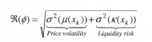| |
| | |Price risk|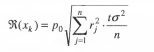| |
|post-trade|porformance|benchmark|Pnl, VMAP(intrady benchmark)| |
| | |RPM|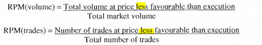| |
| | |Fill ration|Successfully filled orders / total number of orders placed|Rejected or unfilled orders represent the opportunity cost. The market order fill ration may colse to 100%.|
| |Transaction cost|Tax| | |
| | |commission and fees| | |
| | |Delay cost/latency cost|Order size \* (mid price when investment decision was made - mid price when order actually received by the broker)|Measure the price change from the initial decision to invest to the actual price the broker actually receives. This latency cost can also be measured by hold time(the time from placing order to receiving notification of the fill or rejection)|
| | |Timing cost|直接计算： 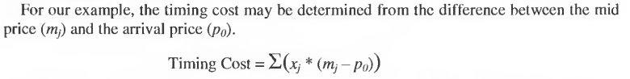| |
| | | |1. Price trend: 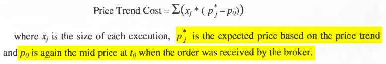|Trendline: cross between the previous close and the days OHLC average|
| | | |2. timing risk 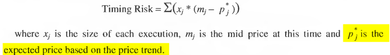|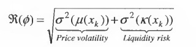 Assumption: price volatility and liquidity risk are independent|
| | |Spread|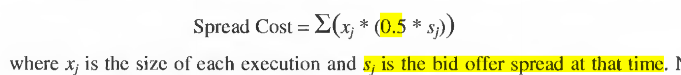| |
| | |Market effect|直接算： 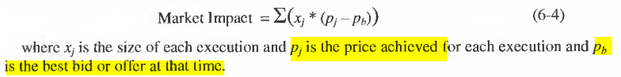|然后可以用以下公式拆解成temporary impact 和permanent impact:( *I* is instantaneous impact cost) 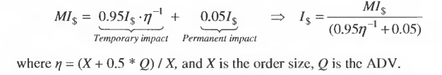 This mode is from making an approximation by using the estimation model from Kissel and Glantz(2004)|
| | | |stochastic process model： 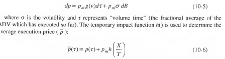 Assumption: price change is actually based on an arithmetic Brownian motion|Almergen et al.(2005) use guass-Newton optimization to calculate the values of exponents: 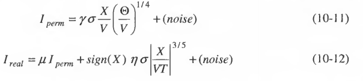|
| | |Opportunity cost|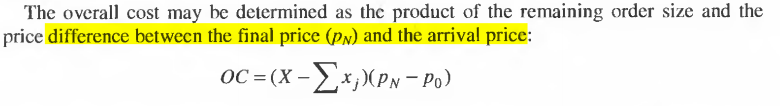|Only realized when a new order makes up the reminder at a less favourable price|
| | |Price variation|(desired or expected price) - (the actual execution price achieved by an order)|Measure the price slippage or improvement. (the expected price of market order can be represented by best bid/ask price, but this calculation is the same as market impact cost)|
| | | |Get the distribution of lifetime of local peaks in the raw ticks by tick market data. Measure the skew towards short lifetimes(skewness < 0 )|Peak: for best bid is when an increase is immediately followed by a decrease. A skew towards shorter lifetimes represents higher price jitter.|
| | | | | |
| | | | | |

## Reference
1. Algorithmic Trading And DMA: An Introduction To Direct Access Trading Strategies. Barry Johnson
2. LMAXExchange-FX-TCA-Transaction-Cost-Analysis-Whitepaper